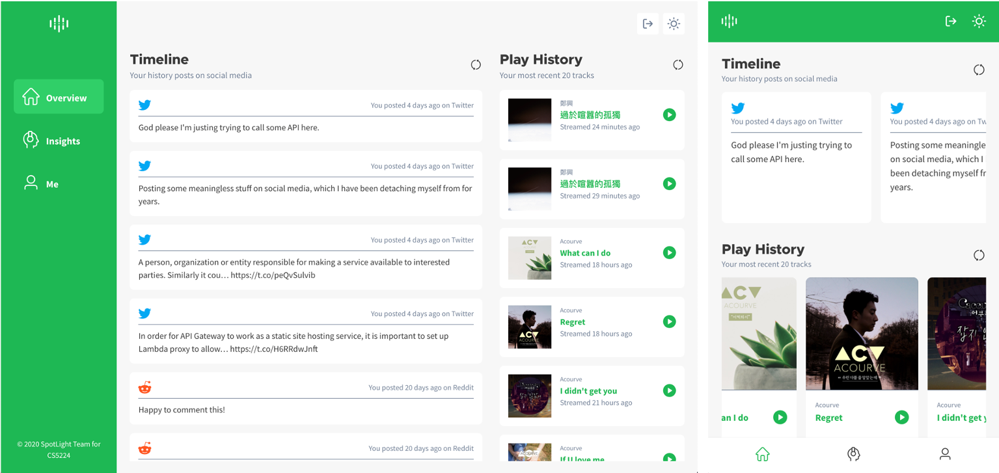

# SpotLight: Shed Light on your Personality with Spotify


**https://www.spotlightpersonality.com/**

> Picture this: You are in a social gathering with an unfamiliar stranger, and you do not really how to continue the conversation. The background music changes to a cheery song, ”Happy” to liven the atmosphere. You may find yourself nodding and smiling to the rhythm, and the stranger smilingly comments: ”Nice song right, what kind of artists or songs are you into”. The conversation can then pick up from there, as you both start to find similar interests together.
>
> Interestingly, in a fast-changing world, the appreciation of music still remains a very relevant theme across different generations. Researchers have concluded that an individual’s taste in music is in fact related to his or her own personality and attitudes. This exciting insight motivated our group to embark on this project, where we want to make use of a person’s Spotify music feed to shed light on his or her personality; therefore, SpotLight!

SpotLight is a Software-as-a-Service (SaaS) aimed at understanding an individual’s personality based from his or her music taste. A high level overview of our pipeline would be as follows: We first retrieve relevant data from multiple data sources: Spotify and each user's social media feed, specifically Facebook, Twitter and Reddit. We then proceed to use commercial SaaS such as IBM Personality Insights and AWS SageMaker where we can essentially profile each user through both their social media content and music taste into different personality groups using machine learning techniques. We can then render these analysis results to the user by delivering SpotLight as a SaaS - a user-friendly web application built on popular frameworks: ReactJS and Flask backend.



## Table of Content

**[Before Starting the Project](#before-starting-the-project)**

**[Getting Started](#getting-started)**

**[Register your Application](#register-your-application)**

**[Miscellaneous](#miscellaneous)**

-   **[To-dos](#to-dos)**

## Before Starting the Project

### Global Dependencies

The project can only be set up when the following dependencies are installed globally on the machine:

#### Python 3.6 or above

You can download the latest Python from [the official page](https://www.python.org/downloads/) or you may download it from [Anaconda Cloud](https://www.anaconda.com/distribution/), which comes with the standard packaged used for Data Science project.

You need to add Python to your PATH variable, and to check whether it was installed correctly, type `python` in the command prompt and it should show:

```bash
> python
Python 3.8.2 (tags/v3.8.2:7b3ab59, Feb 25 2020, 22:45:29) [MSC v.1916 32 bit (Intel)] on win32
Type "help", "copyright", "credits" or "license" for more information.
```

#### More on Python dependencies

There are several choices for managing Python packages (e.g. `setup.py`, `requirement.txt`) and we are using `pipenv` to manage the dependencies needed for this project since it resembles more NPM specifically for development dependencies (i.e. you don't need to install `black` or `autopep8` globally to edit the project).

The dependencies are specified in the `Pipefile` file under `server` directory. More documentation on this could be found on their [official documentation site](https://pipenv.readthedocs.io/en/latest/).

Additionally, `pipenv` automatically activates a virtual environment for your Python project (for more on virtual environment, more on [Python documentation](https://docs.python.org/3/tutorial/venv.html)). Simply run the following in the command line to make sure `pipenv` can be trigger globally:

```bash
# Install pipenv on user level
pip install --user pipenv

# To initiate a virtual environment for the backend directory
cd server
pipenv install --dev # To install dependencies under development mode

# Activate virtual environment
pipenv shell
```

**_For VSCode users_**: By default `pipenv` will initiate a new environment under current user router instead of the project directory. You can manually update the Python path by setting a new `"python.pythonPath"` under workspace setting or select a new interpreter after reloading the window.

#### Node.js v12.13.0 or above

Latest Node.js runtime can be downloaded from its [official website](https://nodejs.org/en/download/). Type `node -v` in the command prompt to see whether it is installed correctly:

```bash
> node -v
v12.13.0
```

#### Redis and Local DynamoDB instance

Redis can be installed via `brew` on MacOS or WSL (Windows Linux Subsystem).

```bash
redis-server
22586:C 22 Apr 2020 21:47:36.599 # oO0OoO0OoO0Oo Redis is starting oO0OoO0OoO0Oo
22586:C 22 Apr 2020 21:47:36.599 # Redis version=5.0.8, bits=64, commit=00000000, modified=0, pid=22586, just started
22586:C 22 Apr 2020 21:47:36.599 # Warning: no config file specified, using the default config. In order to specify a config file use redis-server /path/to/redis.conf
22586:M 22 Apr 2020 21:47:36.600 * Increased maximum number of open files to 10032 (it was originally set to 8192).
```

SpotLight data is stored on AWS DynamoDB. For local development, a downloadable version is available on [AWS documentation page](https://docs.aws.amazon.com/amazondynamodb/latest/developerguide/DynamoDBLocal.html).

## Getting Started

> Please read the previous section [Before Starting the Project](#before-starting-the-project) before you starting the project.

```bash
# 1. Install all dependencies
# You may selectively install only frontend or backend
# code by running npm run install:frontend or npm run install:backend
npm run install:all

# 2. Start the project
# You may selectively start only frontend or backend
# project by running npm run start:frontend or npm run start:backend
npm start
```

### Note on Python Setup

#### Linting and Formatting for VSCode

> Following will be automatically trigger when you open and files with `.py` suffix.

1. Add the Python extension (ms-python.python) for linting. If you have multiple Python versions installed, open the command palette (`Ctrl+Shift+P` on Windows) and search for `Python: Select Interpreter`. Select the one used to run this project.
2. Set the linter to be `flake8`.
3. Set the formatter to be `black` for this project. You might want to enable format on save on your editor.

#### SSL Module in `pip`

If you get "pip is configured with locations that require TLS/SSL, however the ssl module in Python is not available", ensure that your environment variables path have the following:

-   `$USER_HOME\Anaconda3`
-   `$USER_HOME\Anaconda3\Library\bin`
-   `$USER_HOME\Anaconda3]\Scripts`

## Miscellaneous

### To-dos

-   :white_check_mark: Modularize Flask app code
-   :white_check_mark: Refinement on React code (migrating to React Hooks)
-   :white_check_mark: Connection to AWS services for testing
-   :white_check_mark: Deployment to AWS Amplify and API Gateway
-   :white_check_mark: Enable CI/CD
-   :white_check_mark: Move from SCSS and Styled Components to Tailwind CSS (including staged linting, configurations etc.)

### Things to note

-   Ensure that the project resides in a place that does not have spaces in the path. The project will not run if there are spaces.
